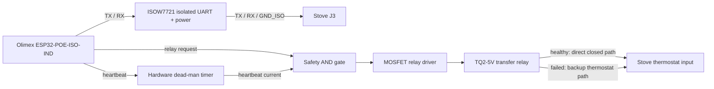

# Preliminary stove-interface daughterboard design

Status: theoretical design checkpoint; not construction-ready and not validated
against the physical J3 or thermostat circuits.

This document turns the permanent-controller concept into a preliminary
circuit-level design that can be resumed after the Phase 1 electrical
measurements. It deliberately keeps the Olimex networking/controller board
replaceable and consolidates the project-specific interface, fail-safe relay,
dead-man logic, protection, and connectors onto one daughterboard.

## Design decision

Use two boards in the permanent assembly:

1. Olimex ESP32-POE-ISO-IND for PoE, Ethernet, Wi-Fi, ESP32 processing, and
   controller-side power.
2. OpenMaxFire daughterboard for isolated J3 UART, local temperature input, and
   fail-safe thermostat transfer.

The daughterboard connects to the Olimex UEXT header for signals and 3.3 V
logic. It also takes a controller-side 5 V auxiliary feed from the Olimex
extension header for the relay coil and integrated isolated-power converter.

The design does not use or require a J3 power pin. Its proposed stove-facing
serial boundary remains TX, RX, and isolated J3 ground only.

## Functional block diagram

## Proposed connectors

| Reference | Connector | Purpose |
| --- | --- | --- |
| J1 | UEXT 2x5 | ESP32 UART, GPIO, 3.3 V, and controller ground |
| J2 | 2-pin auxiliary | Controller-side +5 V and ground from Olimex EXT1 |
| J3 | 3-pin removable terminal | Stove UART TX, RX, and J3 ground |
| J4 | 4-pin removable terminal | Stove thermostat A/B and backup thermostat A/B |
| J5 | 3-pin removable terminal | Local wired DS18B20 temperature sensor |

Connector names describe the daughterboard, not verified physical pin order on
the stove. The stove-side J3 connector must not be keyed or labeled permanently
until the installed controller is measured.

## Proposed UEXT signal allocation

| UEXT function | ESP32 pin | Daughterboard use |
| --- | --- | --- |
| TXD | GPIO4 | Controller UART TX to isolator forward channel |
| RXD | GPIO36 | Controller UART RX from isolator reverse channel |
| SDA | GPIO13 | `RELAY_REQ` |
| SCL | GPIO16 | `HEARTBEAT` |
| SCK | GPIO14 | DS18B20 one-wire data |
| 3.3 V | - | Controller-side logic and sensor power |
| GND | - | Controller-side ground only |

GPIO2, GPIO5, and GPIO15 remain unused in this proposal because they are ESP32
strapping pins. GPIO36 is input-only, which is appropriate for UART RX.

## Isolated J3 serial interface

Candidate U1: TI ISOW7721, normal/non-F default-output option.

- One forward channel carries ESP32 TX to stove RX.
- One reverse channel carries stove TX to ESP32 RX.
- The integrated DC/DC converter produces the isolated stove-side logic supply.
- A solder-jumper or zero-ohm option selects 3.3 V or 5 V isolated output only
  after J3 levels have been measured.
- `GND_ISO` connects only to the verified J3 signal ground.
- Controller ground and `GND_ISO` must not cross the isolation barrier.
- Reserve at least the isolator datasheet's required creepage and clearance;
  the preliminary layout target is an 8 mm copper keepout.
- Place 100-ohm series-resistor footprints and low-capacitance TVS footprints
  beside the J3 connector. Their final values and parts remain measurement-
  dependent.
- Place all required converter, input-side, and isolated-side decoupling exactly
  as specified by the final isolator datasheet and PCB layout guidance.

If measurement shows true bipolar RS-232, an inverted physical layer, or levels
outside the selected ISOW7721 supply, this block must be redesigned. The
isolator must not be connected merely because three wires are present.

## Hardware dead-man and relay driver

A reset-only watchdog is not sufficient by itself: the relay must remain
energized only while firmware continuously proves liveness. The preferred
preliminary circuit therefore uses a retriggerable monostable as a hardware
dead-man.

Candidate logic:

- U2: TI SN74LVC1G123 retriggerable monostable, powered from 3.3 V.
- U3: TI SN74LVC1G08 two-input AND gate, powered from 3.3 V.
- Q1: small logic-level N-channel MOSFET such as AO3400A or a verified
  equivalent.
- K1: Panasonic TQ2-5V non-latching DPDT signal relay.
- D1: flyback diode across the relay coil.
- Gate network: approximately 100-ohm series resistor and 100-kilohm pulldown.

Proposed behavior:

1. Firmware toggles `HEARTBEAT` at a nominal 500 ms interval.
2. Each valid edge retriggers U2. Its Q output, `HB_OK`, remains high only while
   heartbeats continue.
3. U3 computes `COIL_ENABLE = RELAY_REQ AND HB_OK`.
4. Q1 energizes the 5 V relay coil only while `COIL_ENABLE` is high.
5. Loss of ESP32 power, a stopped heartbeat, boot/reset, or a low
   `RELAY_REQ` releases the relay without Home Assistant or network action.

The initial dead-man timeout target is approximately two seconds. Final timing
resistor/capacitor values require calculation from the selected device revision,
temperature/leakage review, and bench validation. On every boot, firmware must
leave `RELAY_REQ` low until the local temperature sensor is valid, J3 data is
current, and the local control loop passes its health checks.

## Thermostat transfer wiring

Use one break-before-make pole of K1 as follows:

| Relay connection | External connection |
| --- | --- |
| COM1 | Stove thermostat terminal A |
| NO1 | Stove thermostat terminal B |
| NC1 | Backup thermostat terminal A |
| Backup thermostat terminal B | Stove thermostat terminal B |

| Controller condition | Relay | Active path |
| --- | --- | --- |
| Boot complete and locally healthy | Energized | Stove A -> NO1 -> Stove B; thermostat input forced closed for J3 control |
| Booting, failed, stale, hung, or unpowered | Released | Stove A -> NC1 -> backup thermostat -> Stove B |

The second relay pole is reserved for position feedback or test pads. It must
not introduce a controller-ground connection to either thermostat terminal.

This transfer does not create another stove ON/OFF input. Current factory-manual
and firmware evidence indicates that an open thermostat input reduces an
already operating stove to level 1, while a closed input permits the selected
level. The physical thermostat cannot independently start a stopped stove. The
separately controlled propane furnace remains the final freeze-protection heat
source.

## Local temperature input

The preliminary sensor connector provides:

- 3.3 V;
- GPIO14 one-wire data;
- controller ground.

Fit a 4.7-kilohm pull-up from data to 3.3 V and reserve protection footprints
appropriate to the installed cable length. The permanent controller must use
this local sensor for autonomous operation and must not depend on a Home
Assistant temperature entity.

## Preliminary parts list

| Reference | Candidate | Function | Locked? |
| --- | --- | --- | --- |
| U1 | TI ISOW7721, non-F | Bidirectional UART isolation and isolated power | No; depends on J3 measurement and availability |
| U2 | TI SN74LVC1G123 | Retriggerable hardware dead-man | No; timing values unselected |
| U3 | TI SN74LVC1G08 | Relay request/heartbeat AND gate | No |
| Q1 | AO3400A-class logic NMOS | Low-side relay-coil driver | No |
| K1 | Panasonic TQ2-5V | Non-latching DPDT thermostat-transfer relay | No; contact measurements required |
| D1 | 1N4148W-class diode | Relay-coil flyback clamp | No |
| TS1 | DS18B20 | Local wired temperature sensor | Candidate |
| J1-J5 | Keyed/removable connectors | Serviceable external wiring | Mechanical selection pending |

Add local 100 nF decoupling at every logic IC, bulk capacitance on the 5 V relay
rail, test pads for both UART directions and both grounds, and clearly separated
controller-side, isolated J3-side, and dry-contact thermostat routing.

## Preliminary PCB placement

Starting target: approximately 70 mm x 45 mm, subject to enclosure, connector,
and mounting measurements.

- Put UEXT, auxiliary 5 V, and temperature connectors on the controller side.
- Put U2, U3, Q1, and the relay coil on the controller side.
- Place U1 across a clearly marked isolation barrier with no copper pours,
  traces, vias, or mounting hardware crossing the keepout.
- Put J3 and its protection immediately beside the isolated side of U1.
- Put the dry-contact thermostat terminal block beside K1 and away from UART
  routing.
- Keep the relay coil and its flyback loop short.
- Provide polarity, pin-1, controller-ground, and isolated-ground silkscreen
  that cannot be confused during field service.

## Power assumptions to verify

The Olimex board documents a 5 V/400 mA isolated PoE converter, but no remaining
current margin is assumed. Measure the complete assembly with Ethernet, Wi-Fi,
UART traffic, isolated converter, relay, and sensor simultaneously active.

The TQ2-5V candidate has a nominal 140 mW coil, approximately 28 mA at 5 V. U1's
input and available isolated output depend on its selected 3.3/5 V configuration
and load. Final power-budget acceptance requires actual board measurements and
the current production datasheets.

## Validation gates before schematic lock

- Verify the installed Olimex board revision and every proposed header pin.
- Identify physical J3 ground, TX, RX, and any other cavity without assuming the
  preserved 9067-0404 diagram matches board 9067-0604.
- Measure J3 idle/active voltage, polarity, direction, source impedance, baud,
  and physical-layer type through a protected interface.
- Measure thermostat open-circuit voltage and closed-circuit current.
- Verify thermostat open/closed behavior in OFF, startup, running, shutdown,
  fault, and power-restoration states.
- Validate J3 ON/OFF/UP/DOWN while the thermostat input is held closed.
- Verify the relay always releases on power loss, ESP32 reset, boot loop,
  firmware hang, missing heartbeat, invalid temperature, and stale J3 data.
- Verify break-before-make transfer does not create a harmful transient.
- Validate local operation with Home Assistant, Ethernet, and Wi-Fi removed.
- Complete creepage, clearance, thermal, enclosure, fuse, connector, and wiring
  review before unattended installation.

Until these gates pass, this is a design record and bench-planning aid, not a
wiring instruction or a freeze-protection system.
