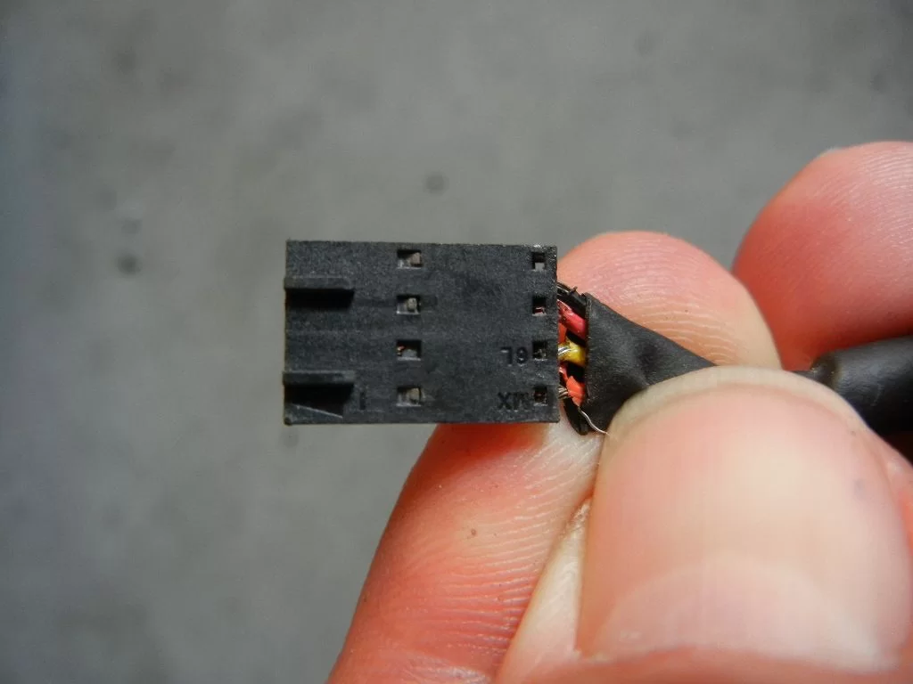

# Historical J3 cable photograph from Bioburner

## Evidence identity

Hearth.com user `Bioburner` posted this photograph on 2014-03-24 in reply to a request for the MaxFire 115 J3 cable pin order. The post contains only the caption “Picture worth a thousand words.”

- Thread: [Bixby maxfire 115, J3 pin out](https://www.hearth.com/talk/threads/bixby-maxfire-115-j3-pin-out.126537/)
- Exact post: [Bioburner, post 1699996](https://www.hearth.com/talk/threads/bixby-maxfire-115-j3-pin-out.126537/#post-1699996)
- Original attachment route: [dscn0386-webp.130415](https://www.hearth.com/talk/attachments/dscn0386-webp.130415/)
- Retrieved by OpenMaxFire: 2026-08-25 UTC
- Preserved filename: `DSCN0386.webp`
- Format and dimensions: WebP, 1024 x 768
- Size: 32,504 bytes
- SHA-256: `244ce6c0b6fcd181bbf34127585d83f365bcd8e28ba489593194420e56c0d67d`

The downloaded bytes are preserved without recompression or visual editing at
[`preservation/original/photos/forum/hearth-126537-post-1699996/DSCN0386.webp`](../../preservation/original/photos/forum/hearth-126537-post-1699996/DSCN0386.webp).

## What the photograph directly shows

- A black, single-row, four-position cable housing viewed close-up.
- Four contact-retention windows and molded guide/recess features on the housing.
- Four insulated conductors entering the rear of the housing. In the photograph's displayed orientation they appear dark/black, red, yellow, and orange-red from top to bottom.
- A black outer cable covering or strain-relief layer pulled back near the housing.

The exact connector manufacturer, series, pitch, contact part number, and mating orientation are not established from this image alone.

## What it does not establish

The photograph does not show:

- the cable connected to a controller board;
- the J3 square pad or another pin-1 reference;
- the relationship between the photographed top/bottom positions and J3 pin numbers;
- the cable's computer-side connector, interface electronics, manufacturer label, or part number;
- voltage, ground, TX, RX, polarity, or continuity measurements.

The original question included a proposed `Power / Ground / Data+ / Data-` assignment. That text belongs to the questioner, not to Bioburner's caption, and the photograph cannot confirm it. J3 is not USB and is not a differential `Data+ / Data-` interface.

The visible red conductor must not be assumed to be safe stove power or FTDI VCC. Historical Bixby cables may have different internal construction and color use. Wire colors are meaningful only after the cable itself has been identified or measured.

## Relationship to the verified OpenMaxFire pinout

This image is useful historical evidence for the shape of a four-position mating cable and the conductor arrangement on Bioburner's particular cable. It is **not** the authoritative OpenMaxFire wiring reference.

OpenMaxFire's corrected, live-validated connection on controller `9067-0604`, serial 5215, is:

| J3 pin | Stove function | Validated FTDI connection |
| ---: | --- | --- |
| 1, square pad | Stove RX | Adapter TX, orange on the tested FTDI cable |
| 2 | Stove TX | Adapter RX, yellow on the tested FTDI cable |
| 3 | Unresolved | Leave disconnected |
| 4 | Ground | Adapter ground, black on the tested FTDI cable |

Adapter VCC was left disconnected. See the [J3 hardware interface](j3-interface.md) and its authoritative successful-connection photograph before attaching anything to a controller.

## Evidence classification and rights

- **Forum record:** Bioburner posted the image as a response to the J3 cable question on 2014-03-24.
- **Direct project observation:** the preserved pixels, dimensions, format, size, attachment route, and cryptographic hash.
- **Not established by this artifact:** electrical pin functions, connector family, cable circuitry, or compatibility with a particular USB adapter.

The photograph remains the property of its original rights holder. Its preservation here supports historical research, interoperability, and appliance repair; OpenMaxFire's MIT License does not relicense it.
