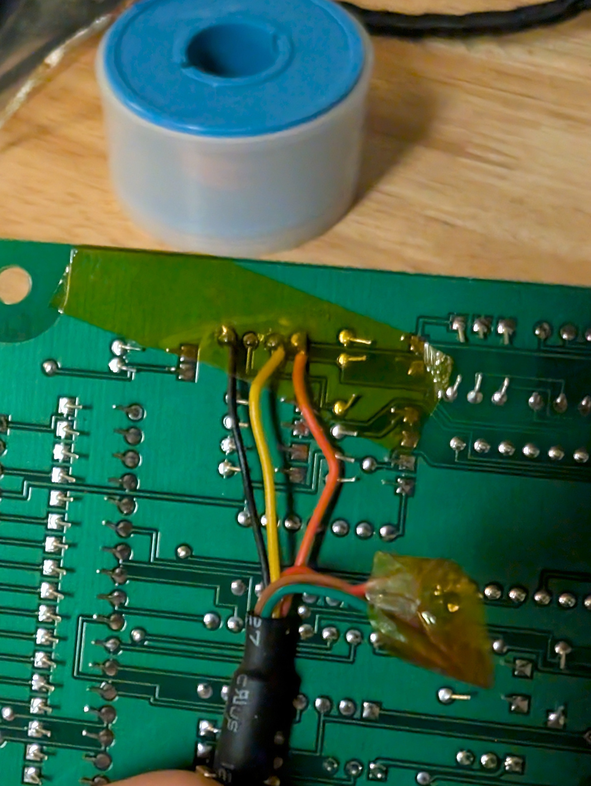

# J3 hardware interface

Status: live-validated on serial 5215's `9067-0604` controller on 2026-08-22.
The tested interface is a non-inverted 5 V TTL-level UART at 9,600 baud for
firmware 2.02/data format 04. Do not generalize the physical pinout to another
board revision without continuity checks.

## Vendor evidence

The BixCheck manual calls for custom Bixby PC cable P/N 2013324. The 2.06
release notes identify J3 as a black four-pin connector behind the exhaust-fan/
feed-rate trim-control tab. Standard PC serial ports or USB-to-RS-232 adapters
connect on the PC side of that active cable; they are not electrically
equivalent to the stove-side interface.

The preserved [MaxFire motherboard diagram](maxfire-motherboard-pinout.md)
independently labels J3 as `Computer Port` on a `9067-0404` board. The
[installed-controller photographs](installed-controller-photographs.md) locate
the equivalent connector, and the later
[bare-controller photographs](bare-controller-photographs.md) directly show
the complete `9067-0604` marking, both PCB sides, J3, PIC16F877A, and `10.000`
MHz oscillator.

## Live-validated pinout

The J3 square pad is pin 1. With the board upright in the documented view, pin
1 is the bottom contact and the confirmed ground/pin 4 is at the top.

| J3 pin | Function | Physical evidence |
| ---: | --- | --- |
| 1 | Stove RX | Corrected continuity/tracing toward PIC physical pin 26, `RC7/RX/DT`; successful transmit path |
| 2 | Stove TX | Corrected continuity/tracing toward PIC physical pin 25, `RC6/TX/CK`; successful receive path |
| 3 | Unresolved; leave disconnected | No function established; earlier standalone-board measurement was 0 V |
| 4 | Board/signal ground | Continuity to board power-input ground |

The two signal paths include nearby passive conditioning/protection components;
they are not routed through a visible MAX232, USB PHY, or RS-485 transceiver.

A preserved forum photograph shows a four-conductor historical cable and can
be visually interpreted as putting a red wire in its third housing position.
It does not show J3 pin numbering, cable electronics, continuity, or voltage.
That unverified color/position clue is deliberately ignored. It does not
override the successful three-wire connection: **do not connect J3-3 or adapter
VCC**. See the [artifact-specific evidence limits](historical-j3-cable-photograph.md).

## Validated cable connection

The working adapter inventory is preserved as
[`maxfire-adapter-identification.json`](../../research/live/2026-08-22-fw202-format04/maxfire-adapter-identification.json):

- FTDI `TTL-232R-5V-WE`;
- VID:PID `0403:6001`;
- adapter serial `ABBAUPPN`.

| FTDI wire | Adapter signal | J3 |
| --- | --- | --- |
| Black | GND | Pin 4 / stove ground |
| Orange | TX | Pin 1 / stove RX |
| Yellow | RX | Pin 2 / stove TX |
| Red | VCC | Disconnected |
| Brown/green | Flow control | Disconnected |

## Authoritative correct-wiring photograph

**This is the correct, live-validated connection for serial 5215:** orange on
J3 pin 1, yellow on J3 pin 2, no connection on J3 pin 3, and black on J3 pin 4.
Only the orange, yellow, and black conductors terminate on J3. The loose green
conductor visible in the cable bundle is not connected. Because this is a
solder-side view, follow the numbered mapping rather than copying apparent
left-to-right screen position.

The older preserved
[`j3-ftdi-incorrect-wiring-solder-side.jpg`](../../preservation/original/photos/serial-5215-bare-controller/j3-ftdi-incorrect-wiring-solder-side.jpg)
shows orange and yellow in the opposite positions. It records an incorrect
pre-validation attachment, is retained only as evidence, and must not be used
as a wiring guide.

The table above is the corrected connection that returned valid `CR0000` and
firmware identity at 9,600
8N1. The red VCC wire was never connected. A DB9/bipolar RS-232 adapter, USB
data cable, or unknown-color generic adapter must not be substituted directly.

## Remaining electrical limits

- J3-3 remains unresolved and must stay unused.
- The successful adapter proves compatibility for this board/cable pair but is
  not a substitute for measuring an unknown controller revision.
- Controller-side isolation remains recommended for a permanent installation.
- The test was performed cold/off and did not validate noise margins while
  motors, igniters, or phase-controlled outputs are operating.
- The stove contains exposed mains circuitry. Perform continuity work only
  while fully disconnected from power.

Protocol framing, live captures, and the read-only test sequence are documented
in [the J3 protocol specification](../protocol/j3-protocol.md) and
[the firmware-2.02 live report](../reverse-engineering/live-fw202-format04.md).
