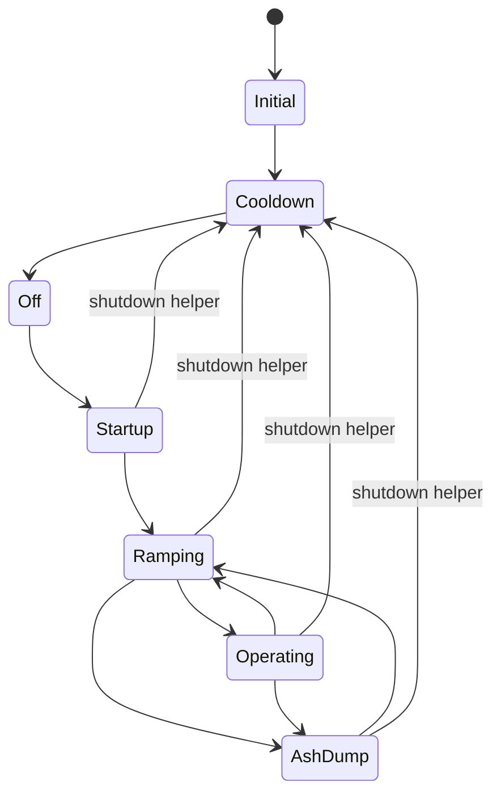

# Firmware operating-state machine

Status: state storage, family dispatch, BixCheck display decoding, and the
structural transition sites are statically confirmed in firmware 2.06, 2.70,
and 2.71. Conditions are named only where the surrounding data flow makes the
meaning clear; no transition has been exercised on a stove.

## Encoding

The controller stores the operating byte in bank-0 RAM `0x4C` and publishes it
as T09. Both sides deliberately ignore bit 7: firmware masks the dispatcher
input with `0x70`, while BixCheck first masks the display value with `0x7F`.

| Bits | Role |
| --- | --- |
| 7 | ignored by both recovered control and display decoders |
| 6:4 | state family (`1` cooldown through `6` ash dump) |
| 3 | thermostat flag while operating (`TSTAT L n`) |
| 2:0 | startup substate or zero-based heat level |

Family 0 is the reset/initial handler. Family 7 is a fallback/undefined
handler. Families 4 and 5 share one firmware handler in every version; bit 4
selects operating (`4x`) versus ramping (`5x`).

## Recovered topology

The shutdown helper is structurally global, so the diagram shows the
meaningful active families that can reach it rather than claiming an exhaustive
call-condition proof. The family-7 fallback has no recovered normal-state role.

## Dispatcher locations

Each dispatcher uses the high nibble of RAM `0x4C` as an eight-way computed
jump. The low bits remain available to the selected handler.

| Family | Meaning | 2.06 handler | 2.70 handler | 2.71 handler |
| ---: | --- | ---: | ---: | ---: |
| `0x00` | initial/reset | `18F5` | `18EE` | `1913` |
| `0x10` | cooldown | `192B` | `192B` | `1950` |
| `0x20` | off | `1976` | `1982` | `19A7` |
| `0x30` | startup | `19E8` | `1A02` | `1A27` |
| `0x40` | operating | `1BBA` | `1BDB` | `1C00` |
| `0x50` | ramping | `1BBA` | `1BDB` | `1C00` |
| `0x60` | ash dump | `1CE0` | `1D19` | `1D3E` |
| `0x70` | fallback/undefined | `1E25` | `1E3D` | `1E5D` |

Dispatcher PCs are `18DB`, `18D4`, and `18F9`, respectively. These anchors and
all 24 destinations are regenerated into
`reverse-engineering/firmware/comparison/state-family-dispatch.csv` and checked
by `tests/test_firmware_pipeline.py`.

## 2.71 structural transitions

2.71 is the newest and most directly relevant image. The table records the
exact instruction sites that alter the family bits; it does not invent names
for every predicate feeding those writes.

| From | To | 2.71 site | Structural operation |
| --- | --- | ---: | --- |
| reset | initial | `1847` | clears RAM `0x4C` |
| initial | cooldown | `192F`-`1933` | installs family `0x10` |
| cooldown | off | `198B`-`1990` | installs family `0x20` |
| off | startup | `19DC`, `19FC`-`1A00` | clears state then ORs family `0x30` |
| startup | startup substate | `1A59`-`1A64` | updates low startup bits without changing family |
| startup | ramping | `1BE4`-`1BEE` | installs family `0x50` |
| operating | ramping | `1CEE` | sets state bit 4 (`4x` → `5x`) |
| ramping | operating | `1D05` | clears state bit 4 (`5x` → `4x`) |
| operating/ramping | ash dump | `1D11`-`1D13` | installs family `0x60` |
| ash dump | ramping | `1E55`-`1E58` | installs family `0x50` |
| active state | cooldown | helper `1394` | writes `0x10` |

The equivalent handler topology exists in 2.06 and 2.70 with shifted code
addresses. Fine-grained branch predicates have not yet all been assigned
semantic variable names. In particular, this pass proves where family changes
happen, not the temperature, timer, alarm, door, or request condition required
to take each branch.

## Startup and level display

BixCheck 5.5.01's implemented decoder is more precise than the older prose
manual:

| Normalized value | Display |
| ---: | --- |
| `30` | Prefill |
| `31` | Started |
| `32` | Starting |
| `33` | Ignited |
| `34`-`37` | Error |
| `40`-`47` | Level 1-8 |
| `48`-`4F` | TSTAT L 1-8 |
| `50`-`5F` | Ramping |
| `60`-`6F` | Ash dump |

OpenMaxFire implements these rules in `decode_operating_state()` and preserves
the raw and normalized bytes. It should continue exposing unknown values as
unknown rather than coercing them into the nearest familiar state.

## Vendor thermostat behavior and revision scope

The MaxFire Model 115 owner manual, document 2020866 Rev. A, says an unpowered
on/off 24 V thermostat does not start the stove. When an already-running stove
receives a heat call it uses the selected heat level; without a call it falls
back to level 1 and slowly flashes the panel indicators together. That behavior
agrees with the T09 operating-family thermostat flag but does not prove every
later transition predicate.

Format-07 BixCheck data adds thermostat heat-level and disable-auto-restart
configuration bits. OpenMaxFire therefore records the Rev. A statement as a
revision-scoped baseline and requires live, configuration-aware validation
before treating firmware 2.70/2.71 or serial 5215 as automatically restartable.

## Safety boundary

The state machine remains factory-controller behavior. A future host can use
T09 to verify a requested transition, but it must not duplicate combustion
logic or infer command success merely because a serial write completed. Live
validation begins with passive/read-only observation while the appliance is
cold and off.
